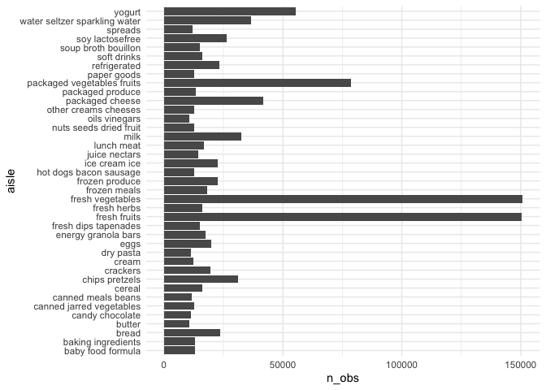

p8105\_hw3\_xs2447
================

Basic setting

``` r
library(tidyverse)
```

    ## ── Attaching packages ─────────────────────────────────────── tidyverse 1.3.1 ──

    ## ✓ ggplot2 3.3.5     ✓ purrr   0.3.4
    ## ✓ tibble  3.1.4     ✓ dplyr   1.0.7
    ## ✓ tidyr   1.1.3     ✓ stringr 1.4.0
    ## ✓ readr   2.0.1     ✓ forcats 0.5.1

    ## ── Conflicts ────────────────────────────────────────── tidyverse_conflicts() ──
    ## x dplyr::filter() masks stats::filter()
    ## x dplyr::lag()    masks stats::lag()

``` r
library(leaflet)

knitr::opts_chunk$set(
  fig.width = 6,
  fig.asp = .6,
  out.width = "90%"
)

theme_set(theme_minimal() + theme(legend.position = "bottom"))

options(
  ggplot2.continuous.colour = "viridis",
  ggplot2.continuous.fill = "viridis"
)

scale_colour_discrete = scale_colour_viridis_d
scale_fill_discrete = scale_fill_viridis_d
```

\#\#Problem 1

load in Instacart dataset

``` r
library(p8105.datasets)
data("instacart")
```

There are 1384617 rows and 15 variables. Each row of the dataset is a
product from an order and the product from the same product\_id are
listed in adjacent rows. Some important variables of the dataset are
order id, product\_id, used\_id, aisle\_id and department\_id, which are
identifiers. Besides, order\_dow is also an important variable to
indicated the day of the week on which the order was placed. For
example, order number 1 made by user 112108 has 8 products in it and it
is placed 10am on Thursday. 4 of the 8 products belong to produce
department, while the rest come from dairy eggs and canned goods
department.

\*How many aisles are there, and which aisles are the most items ordered
from?

``` r
aisle_df = instacart %>% 
  group_by(aisle,aisle_id) %>% 
  summarize(n_obs = n()) %>% 
  arrange(desc(n_obs))
```

    ## `summarise()` has grouped output by 'aisle'. You can override using the `.groups` argument.

``` r
aisle_df
```

    ## # A tibble: 134 × 3
    ## # Groups:   aisle [134]
    ##    aisle                         aisle_id  n_obs
    ##    <chr>                            <int>  <int>
    ##  1 fresh vegetables                    83 150609
    ##  2 fresh fruits                        24 150473
    ##  3 packaged vegetables fruits         123  78493
    ##  4 yogurt                             120  55240
    ##  5 packaged cheese                     21  41699
    ##  6 water seltzer sparkling water      115  36617
    ##  7 milk                                84  32644
    ##  8 chips pretzels                     107  31269
    ##  9 soy lactosefree                     91  26240
    ## 10 bread                              112  23635
    ## # … with 124 more rows

There are 134 aisles and fresh vegetables has the most (150609 in total)
ordered items.

\*Make a plot that shows the number of items ordered in each aisle,
limiting this to aisles with more than 10000 items ordered. Arrange
aisles sensibly, and organize your plot so others can read it.

``` r
aisle_df %>% 
  filter(n_obs > 10000) %>% 
  ggplot(aes(x = aisle, y = n_obs)) +
  geom_col() +
  coord_flip() 
```


There are 39 aisles with more than 10000 items ordered. From these 39
aisles, fresh vegetables aisle has the most items, while butter has the
least items.

\*Make a table showing the three most popular items in each of the
aisles “baking ingredients”, “dog food care”, and “packaged vegetables
fruits”. Include the number of times each item is ordered in your table.

``` r
three_pop = instacart %>% 
  filter(aisle %in% c("baking ingredients","dog food care", "packaged vegetables fruits")) %>% 
  group_by(aisle) %>% 
  count(product_name, name = "product_count") %>% 
  mutate(product_rank = min_rank(desc(product_count))) %>% 
  filter(product_rank <= 3) %>% 
  arrange(aisle, product_rank) %>% 
  knitr::kable()

three_pop
```

| aisle                      | product\_name                                 | product\_count | product\_rank |
|:---------------------------|:----------------------------------------------|---------------:|--------------:|
| baking ingredients         | Light Brown Sugar                             |            499 |             1 |
| baking ingredients         | Pure Baking Soda                              |            387 |             2 |
| baking ingredients         | Cane Sugar                                    |            336 |             3 |
| dog food care              | Snack Sticks Chicken & Rice Recipe Dog Treats |             30 |             1 |
| dog food care              | Organix Chicken & Brown Rice Recipe           |             28 |             2 |
| dog food care              | Small Dog Biscuits                            |             26 |             3 |
| packaged vegetables fruits | Organic Baby Spinach                          |           9784 |             1 |
| packaged vegetables fruits | Organic Raspberries                           |           5546 |             2 |
| packaged vegetables fruits | Organic Blueberries                           |           4966 |             3 |

\*Make a table showing the mean hour of the day at which Pink Lady
Apples and Coffee Ice Cream are ordered on each day of the week; format
this table for human readers (i.e. produce a 2 x 7 table).

``` r
mean_hour_of_day = instacart %>% 
  filter(product_name %in% c("Pink Lady Apples", "Coffee Ice Cream")) %>% 
  group_by(order_dow) %>% 
  summarize(mean_hour = mean(order_hour_of_day)) %>% 
  knitr::kable()

mean_hour_of_day
```

| order\_dow | mean\_hour |
|-----------:|-----------:|
|          0 |   13.60000 |
|          1 |   12.17391 |
|          2 |   12.83824 |
|          3 |   14.68519 |
|          4 |   13.17308 |
|          5 |   12.64286 |
|          6 |   13.25000 |

## Problem 2

load BRFSS dataset

``` r
data("brfss_smart2010")
```

*format the data to use appropriate variable names *focus on the
“Overall Health” topic *include only responses from “Excellent” to
“Poor” *organize responses as a factor taking levels ordered from “Poor”
to “Excellent”

``` r
brfss = brfss_smart2010 %>% 
  janitor::clean_names() %>% 
  filter(topic == "Overall Health") %>%
  filter(response %in% c("Poor","Fair", "Good", "Very good", "Excellent")) %>% 
  arrange(factor(response, c("Poor","Fair", "Good", "Very good", "Excellent")))
```

\*In 2002, which states were observed at 7 or more locations? What about
in 2010?

\*Construct a dataset that is limited to Excellent responses, and
contains, year, state, and a variable that averages the data\_value
across locations within a state. Make a “spaghetti” plot of this average
value over time within a state (that is, make a plot showing a line for
each state across years – the geom\_line geometry and group aesthetic
will help).

\*Make a two-panel plot showing, for the years 2006, and 2010,
distribution of data\_value for responses (“Poor” to “Excellent”) among
locations in NY State.
