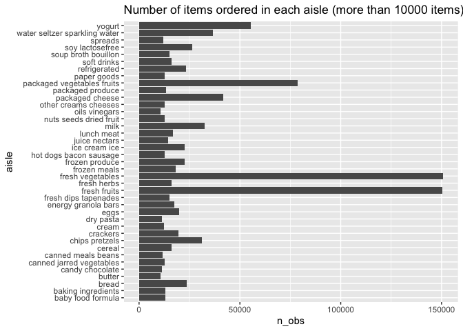
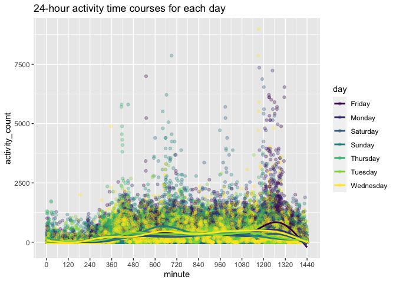

p8105\_hw3\_xs2447
================

Basic setting

``` r
library(tidyverse)
```

    ## ── Attaching packages ─────────────────────────────────────── tidyverse 1.3.1 ──

    ## ✓ ggplot2 3.3.5     ✓ purrr   0.3.4
    ## ✓ tibble  3.1.4     ✓ dplyr   1.0.7
    ## ✓ tidyr   1.1.3     ✓ stringr 1.4.0
    ## ✓ readr   2.0.1     ✓ forcats 0.5.1

    ## ── Conflicts ────────────────────────────────────────── tidyverse_conflicts() ──
    ## x dplyr::filter() masks stats::filter()
    ## x dplyr::lag()    masks stats::lag()

``` r
library(leaflet)
library(gghighlight)

theme_set(theme_minimal() + theme(legend.position = "bottom"))

options(
  ggplot2.continuous.colour = "viridis",
  ggplot2.continuous.fill = "viridis"
)

scale_colour_discrete = scale_colour_viridis_d
scale_fill_discrete = scale_fill_viridis_d
```

\#\#Problem 1

load in Instacart dataset

``` r
library(p8105.datasets)
data("instacart")
```

There are 1384617 rows and 15 variables. Each row of the dataset is a
product from an order and the product from the same product\_id are
listed in adjacent rows. Some important variables of the dataset are
order id, product\_id, used\_id, aisle\_id and department\_id, which are
identifiers. Besides, order\_dow is also an important variable to
indicated the day of the week on which the order was placed. For
example, order number 1 made by user 112108 has 8 products in it and it
is placed 10am on Thursday. 4 of the 8 products belong to produce
department, while the rest come from dairy eggs and canned goods
department.

\*How many aisles are there, and which aisles are the most items ordered
from?

``` r
aisle_df = instacart %>% 
  group_by(aisle,aisle_id) %>% 
  summarize(n_obs = n()) %>% 
  arrange(desc(n_obs))
```

    ## `summarise()` has grouped output by 'aisle'. You can override using the `.groups` argument.

``` r
aisle_df
```

    ## # A tibble: 134 × 3
    ## # Groups:   aisle [134]
    ##    aisle                         aisle_id  n_obs
    ##    <chr>                            <int>  <int>
    ##  1 fresh vegetables                    83 150609
    ##  2 fresh fruits                        24 150473
    ##  3 packaged vegetables fruits         123  78493
    ##  4 yogurt                             120  55240
    ##  5 packaged cheese                     21  41699
    ##  6 water seltzer sparkling water      115  36617
    ##  7 milk                                84  32644
    ##  8 chips pretzels                     107  31269
    ##  9 soy lactosefree                     91  26240
    ## 10 bread                              112  23635
    ## # … with 124 more rows

There are 134 aisles and fresh vegetables has the most (150609 in total)
ordered items.

\*Make a plot that shows the number of items ordered in each aisle,
limiting this to aisles with more than 10000 items ordered. Arrange
aisles sensibly, and organize your plot so others can read it.

``` r
aisle_df %>% 
  filter(n_obs > 10000) %>% 
  ggplot(aes(x = aisle, y = n_obs)) +
  geom_col() +
  coord_flip() 
```

<!-- -->

There are 39 aisles with more than 10000 items ordered. From these 39
aisles, fresh vegetables aisle has the most items, while butter has the
least items.

\*Make a table showing the three most popular items in each of the
aisles “baking ingredients”, “dog food care”, and “packaged vegetables
fruits”. Include the number of times each item is ordered in your table.

``` r
three_pop = instacart %>% 
  filter(aisle %in% c("baking ingredients","dog food care", "packaged vegetables fruits")) %>% 
  group_by(aisle) %>% 
  count(product_name, name = "product_count") %>% 
  mutate(product_rank = min_rank(desc(product_count))) %>% 
  filter(product_rank <= 3) %>% 
  arrange(aisle, product_rank) %>% 
  knitr::kable()

three_pop
```

| aisle                      | product\_name                                 | product\_count | product\_rank |
|:---------------------------|:----------------------------------------------|---------------:|--------------:|
| baking ingredients         | Light Brown Sugar                             |            499 |             1 |
| baking ingredients         | Pure Baking Soda                              |            387 |             2 |
| baking ingredients         | Cane Sugar                                    |            336 |             3 |
| dog food care              | Snack Sticks Chicken & Rice Recipe Dog Treats |             30 |             1 |
| dog food care              | Organix Chicken & Brown Rice Recipe           |             28 |             2 |
| dog food care              | Small Dog Biscuits                            |             26 |             3 |
| packaged vegetables fruits | Organic Baby Spinach                          |           9784 |             1 |
| packaged vegetables fruits | Organic Raspberries                           |           5546 |             2 |
| packaged vegetables fruits | Organic Blueberries                           |           4966 |             3 |

The most popular products in baking ingredients are Light Brown Sugar,
Pure Baking Soda and Cane Sugar. From dog food care, the most three
popular products are Snack Sticks Chicken & Rice Recipe Dog Treats,
Organix Chicken & Brown Rice Recipe, and Small Dog Biscuits. From
packaged vegetables fruits, Organic Baby Spinach, Organic Raspberries,
and Organic Blueberries are most popular.

\*Make a table showing the mean hour of the day at which Pink Lady
Apples and Coffee Ice Cream are ordered on each day of the week; format
this table for human readers (i.e. produce a 2 x 7 table).

``` r
mean_hour_of_day = instacart %>% 
  filter(product_name %in% c("Pink Lady Apples", "Coffee Ice Cream")) %>% 
  group_by(order_dow) %>% 
  summarize(mean_hour = mean(order_hour_of_day)) %>% 
  knitr::kable()

mean_hour_of_day
```

| order\_dow | mean\_hour |
|-----------:|-----------:|
|          0 |   13.60000 |
|          1 |   12.17391 |
|          2 |   12.83824 |
|          3 |   14.68519 |
|          4 |   13.17308 |
|          5 |   12.64286 |
|          6 |   13.25000 |

For Pink Lady Apples and Coffee Ice Cream, the mean hour of order is at
mid of the day on each day, the mean ranges from 12.17391 to 14.68519.

## Problem 2

load BRFSS dataset

``` r
data("brfss_smart2010")
```

*format the data to use appropriate variable names *focus on the
“Overall Health” topic *include only responses from “Excellent” to
“Poor” *organize responses as a factor taking levels ordered from “Poor”
to “Excellent”

``` r
brfss = brfss_smart2010 %>% 
  janitor::clean_names() %>% 
  filter(topic == "Overall Health") %>%
  filter(response %in% c("Poor","Fair", "Good", "Very good", "Excellent")) %>% 
  arrange(factor(response, c("Poor","Fair", "Good", "Very good", "Excellent"))) %>% 
  rename(state = locationabbr, location = locationdesc)
```

\*In 2002, which states were observed at 7 or more locations? What about
in 2010?

``` r
brfss_2002 = brfss %>% 
  filter(year == 2002) %>% 
  group_by(state) %>% 
  summarize(obs_7 = n_distinct(location)) %>% 
  filter(obs_7 >= 7)
  
brfss_2002
```

    ## # A tibble: 6 × 2
    ##   state obs_7
    ##   <chr> <int>
    ## 1 CT        7
    ## 2 FL        7
    ## 3 MA        8
    ## 4 NC        7
    ## 5 NJ        8
    ## 6 PA       10

There are 6 states were observed at 7 or more locations in 2002,
including CT, FL, MA, NC, NJ and PA.

``` r
brfss_2010 = brfss %>% 
  filter(year == 2010) %>% 
  group_by(state) %>% 
  summarize(obs_7 = n_distinct(location)) %>% 
  filter(obs_7 >= 7)
  
brfss_2010
```

    ## # A tibble: 14 × 2
    ##    state obs_7
    ##    <chr> <int>
    ##  1 CA       12
    ##  2 CO        7
    ##  3 FL       41
    ##  4 MA        9
    ##  5 MD       12
    ##  6 NC       12
    ##  7 NE       10
    ##  8 NJ       19
    ##  9 NY        9
    ## 10 OH        8
    ## 11 PA        7
    ## 12 SC        7
    ## 13 TX       16
    ## 14 WA       10

There are 14 states were observed at 7 or more locations in 2010,
including CA, CO, FL, MA, MD, NC, NE, NJ, NY, OH, PA, SC, TX, and WA.

\*Construct a dataset that is limited to Excellent responses, and
contains, year, state, and a variable that averages the data\_value
across locations within a state. Make a “spaghetti” plot of this average
value over time within a state (that is, make a plot showing a line for
each state across years – the geom\_line geometry and group aesthetic
will help).

``` r
brfss %>% 
  filter(response == "Excellent") %>% 
  group_by(state, year) %>% 
  summarize(means = mean(data_value)) %>% 
  ggplot(aes(x = year, y = means, color = state)) +
  geom_line(alpha = .6) 
```

    ## `summarise()` has grouped output by 'state'. You can override using the `.groups` argument.

    ## Warning: Removed 3 row(s) containing missing values (geom_path).

<!-- -->

From the plot, we can find that maximum means of the data\_value is
generally decreasing from 2002 to 2010, while the minimum means flutuate
a lots.

``` r
brfss %>% 
  filter(response == "Excellent") %>% 
  group_by(state, year) %>% 
  summarize(means = mean(data_value)) %>% 
  ggplot(aes(x = year, y = means, color = state)) +
  geom_line(alpha = .6) +
  gghighlight(state == "WV") 
```

    ## `summarise()` has grouped output by 'state'. You can override using the `.groups` argument.

    ## Warning: Tried to calculate with group_by(), but the calculation failed.
    ## Falling back to ungrouped filter operation...

    ## label_key: state

    ## Warning: Removed 3 row(s) containing missing values (geom_path).

<!-- -->

If we highlight the WV state, we can also find that for most of the
time, the mean value of data in this state is lower than others’.

\*Make a two-panel plot showing, for the years 2006, and 2010,
distribution of data\_value for responses (“Poor” to “Excellent”) among
locations in NY State.

``` r
brfss %>% 
  filter(state == "NY", year == c(2006, 2010)) %>% 
  ggplot(aes(x = response)) +
  geom_bar() + 
  facet_grid(.~year)
```

    ## Warning in year == c(2006, 2010): longer object length is not a multiple of
    ## shorter object length

<!-- -->

From the plot, we can see that the responses is equally distributed in
2006 while in 2010, more people choose good or poor. We can also find we
get more response in 2010 compare to 2006.

## Problem 3

\*Load, tidy, and otherwise wrangle the data. Your final dataset should
include all originally observed variables and values; have useful
variable names; include a weekday vs weekend variable; and encode data
with reasonable variable classes. Describe the resulting dataset
(e.g. what variables exist, how many observations, etc).

``` r
accel_df = read_csv("accel_data.csv")
```

    ## Rows: 35 Columns: 1443

    ## ── Column specification ────────────────────────────────────────────────────────
    ## Delimiter: ","
    ## chr    (1): day
    ## dbl (1442): week, day_id, activity.1, activity.2, activity.3, activity.4, ac...

    ## 
    ## ℹ Use `spec()` to retrieve the full column specification for this data.
    ## ℹ Specify the column types or set `show_col_types = FALSE` to quiet this message.

``` r
accel_tidy_df = accel_df %>% 
  mutate(
    week_doe = if_else(day %in% c("Saturday", "Sunday"), "weekend","weekday")
    ) %>% 
  relocate(week, day_id, day, week_doe) %>% 
  pivot_longer(activity.1:activity.1440,
               names_to = "minute",
               names_prefix = "activity.",
               values_to = "activity_count") %>% 
  mutate(minute = as.double(minute))
```

The original dataset has 35 rows and 1143 columns. After tidying up, the
dataset has 50400 rows and 6 variables, including the week number, the
day number, the day of the week, weekday or weekend, minute number and
the activity count at each specific time. The dataset records the
activity count over 35 days.

\*Traditional analyses of accelerometer data focus on the total activity
over the day. Using your tidied dataset, aggregate accross minutes to
create a total activity variable for each day, and create a table
showing these totals. Are any trends apparent?

``` r
accel_tidy_df %>% 
  group_by(day_id) %>% 
  summarize(day_total = sum(activity_count)) %>% 
  knitr::kable()
```

| day\_id | day\_total |
|--------:|-----------:|
|       1 |  480542.62 |
|       2 |   78828.07 |
|       3 |  376254.00 |
|       4 |  631105.00 |
|       5 |  355923.64 |
|       6 |  307094.24 |
|       7 |  340115.01 |
|       8 |  568839.00 |
|       9 |  295431.00 |
|      10 |  607175.00 |
|      11 |  422018.00 |
|      12 |  474048.00 |
|      13 |  423245.00 |
|      14 |  440962.00 |
|      15 |  467420.00 |
|      16 |  685910.00 |
|      17 |  382928.00 |
|      18 |  467052.00 |
|      19 |  371230.00 |
|      20 |  381507.00 |
|      21 |  468869.00 |
|      22 |  154049.00 |
|      23 |  409450.00 |
|      24 |    1440.00 |
|      25 |  260617.00 |
|      26 |  340291.00 |
|      27 |  319568.00 |
|      28 |  434460.00 |
|      29 |  620860.00 |
|      30 |  389080.00 |
|      31 |    1440.00 |
|      32 |  138421.00 |
|      33 |  549658.00 |
|      34 |  367824.00 |
|      35 |  445366.00 |

The total counts of activity fluctuate significantly, range from 1440 to
685910, so there is no apparent trend.

\*Accelerometer data allows the inspection activity over the course of
the day. Make a single-panel plot that shows the 24-hour activity time
courses for each day and use color to indicate day of the week. Describe
in words any patterns or conclusions you can make based on this graph.

``` r
accel_tidy_df %>% 
  ggplot(aes(x = minute, y = activity_count, color = day)) +
  geom_point(alpha = .3) +
  geom_smooth(alpha = .7, se = FALSE) + 
  scale_x_continuous(breaks = seq(0, 1440, 120))
```

    ## `geom_smooth()` using method = 'gam' and formula 'y ~ s(x, bs = "cs")'

<!-- -->

From the plot, we can see that the activity count is relatively low from
about 0 to 300 minute, and from 1320 to 1440 minute. These minutes are
about 10pm to 6am. Therefore, generally speaking, the activity count is
low when people are asleep. The peaks of the activity count often happen
from about 360 to 720 minute (6am to 12pm), 960 to 1020 (4pm to 5pm),
and 1140 to 1320 (7pm to 10pm). At these times, people are more likely
doing activity, therefore the count is high. Besides, we can also find
that the people usually doing more activity at Friday night. On
Wednesday, this people are usually doing heaviest activity at about
7:30pm.
